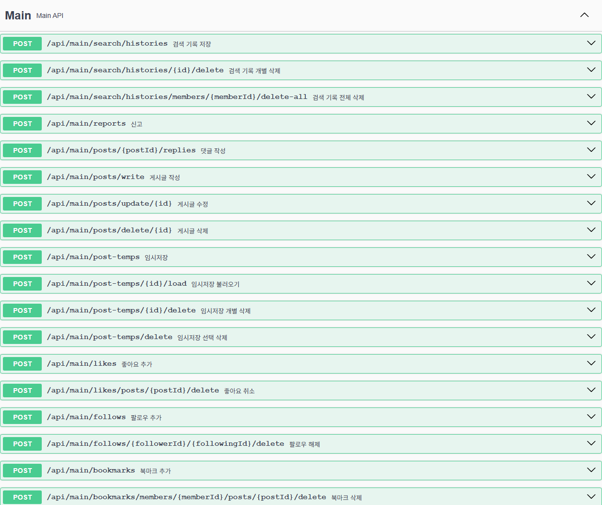
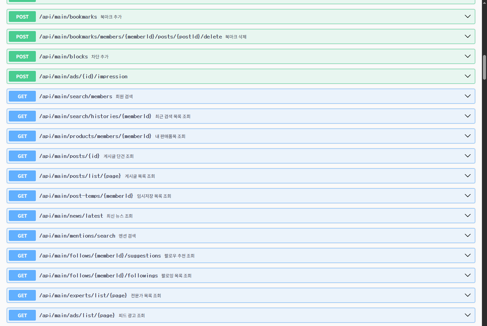

## 담당 페이지

| 페이지 | URL | 주요 역할 |
| --- | --- | --- |
| 메인 페이지 | `/main/main` | 피드 조회, 게시글 작성, 광고 목록, 전문가 목록 제공 |
| 구독 페이지 | `/subscribe` | 구독 플랜 선택, 결제, 현재 구독 조회, 구독 해지 |
| 친구 페이지 | `/friends` | 추천 커넥션, 팔로워/팔로잉 목록, 카테고리 기반 탐색 |

## 메인 페이지

메인 페이지는 사용자가 서비스에 진입했을 때 가장 먼저 사용하는 피드 중심 화면입니다. 게시글 조회와 작성뿐 아니라 좋아요, 북마크, 팔로우, 신고, 차단, 댓글, 광고 노출을 포함하는 회원들의 활동 영역입니다.

### 주요 기능

- 게시글 목록 무한스크롤 조회
- 게시글 작성, 수정, 삭제
- 댓글 작성 및 댓글 목록 조회
- 이미지/파일 업로드와 S3 Presigned URL 변환
- 좋아요 추가 및 취소
- 북마크 추가 및 취소
- 팔로우 및 팔로우 취소
- 게시글 / 회원 신고
- 회원간 차단
- 게시글 임시 저장
- 피드 목록에서 광고 조회
- 전문가 목록 조회

## 구독 페이지

구독 페이지는 사용자가 원하는 플랜을 선택하고 결제를 진행하는 화면입니다. 현재 적용중인 플랜 상태(free포함)를 기준으로 구독, 해지, 플랜 선택이 가능하며, Bootpay 결제 결과를 서버 구독 데이터와 연결합니다.

### 주요 기능

- 현재 로그인 사용자의 구독 정보 조회
- Free, Pro, Pro+, Expert 플랜 표시
- 월간/연간 결제 옵션 제공
- Bootpay 단건 결제 처리
- Bootpay 빌링키 발급, 정기결제
- 월간 구독 해지
- Expert 구독 시 회원 역할 변경
- 구독 등급에 따른 뱃지 부여
- 구독 만료 및 정기결제 갱신 스케줄 처리

## 친구 페이지

Friends 페이지는 사용자가 새로운 커넥션을 찾고, 본인 또는 다른 사용자의 커넥터/커넥팅 목록을 확인하는 화면입니다. 추천 회원목록, 회원가입시 선택하는 카테고리로 찾는 필터기능, 팔로우 상태를 반영합니다.

### 주요 기능

- 추천 커넥션 회원목록 조회
- 대카테고리 기반 추천목록 필터링
- 커넥터 목록 조회
- 커넥팅 목록 조회
- 본인 친구 페이지와 타인 친구 페이지 구분
- 탭별 목록 및 카운트 갱신
- 무한스크롤 페이징
- Connect/Disconnect 버튼 상태 관리
- Expert 회원의 Follow/Unfollow 표시 분기
- 이용중인 로그인 사용자 기준 차단 필터 적용

## 페이지별 핵심 요약

| 페이지 | 핵심 책임 |
| --- | --- |
| 메인 | 사용자 피드와 소셜 상호작용 처리 |
| 구독 | 결제, 구독 상태, 등급별 권한 처리 |
| 친구 | 커넥션 추천과 팔로우(전문가) 관계 탐색 |
